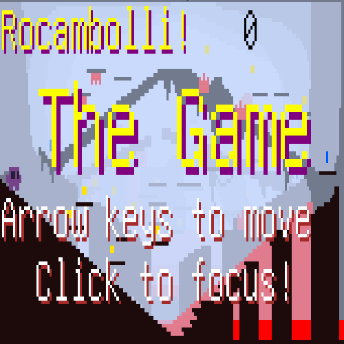

# Rocambolli

This is my first platformer. An entry to Ludum-Dare 37.

[You can play here on itch.io.](https://eri0o.itch.io/rocambolli)

I am using my codes below:

 - **[png-font](https://github.com/ericoporto/png-font) :** for pixel font drawing.

 - **[color.js](https://github.com/ericoporto/TouchyEngine/blob/master/color.js) :** tiny 1.47kb js for color normalization.
